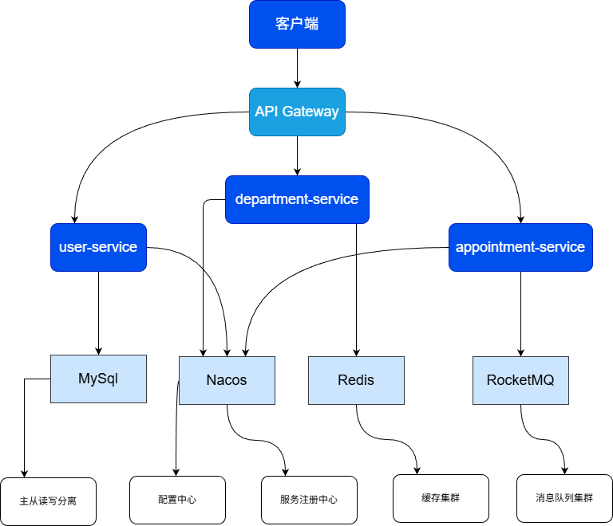

# **✅ 项目总览：MediCare Platform（医疗诊疗服务平台）**

> **GitHub 地址**：[mikuFans010309/medi-care-platform: 项目名称：MediCare Platform（医疗诊疗服务平台）](https://github.com/mikuFans010309/medi-care-platform)
> **当前版本**：v1.0.0-SNAPSHOT
> **技术栈**：Spring Boot 3.2 + Spring Cloud Alibaba + Nacos + MyBatis-Plus + JWT + Swagger
> **部署状态**：本地开发环境已就绪

------

## **📌 项目简介**

`MediCare Platform` 是一个面向医疗机构的**分布式微服务架构医疗诊疗服务平台**，旨在提供患者挂号、医生排班、电子病历、在线支付等核心功能。本项目采用 **Spring Cloud Alibaba 微服务架构**，具备高可用、可扩展、易维护的特点，适用于中大型医疗信息化系统建设。

当前已完成：

- 项目骨架搭建（多模块 Maven 工程）
- 数据库初始化与基础表设计
- 用户服务（user-service）完整实现
- 基于 JWT 的无状态认证体系
- API 网关路由与接口文档支持（Swagger）

------

## **🔧 技术架构图**



------

## **🏗️ 项目结构说明**

```
medi-care-platform/
├── docs/                     # 项目文档
│   ├── phase1-project-init.md
│   ├── phase2-user-service.md
│   └── tech-stack-versions.md
├── sql/                      # SQL 脚本
│   ├── v1.0_init_schema.sql
│   └── v1.1_init_admin.sql
├── services/                 # 微服务模块
│   ├── user-service/         # 用户管理服务（已完成）
│   │   ├── src/main/java/com/mediacare/user/
│   │   ├── src/main/resources/application.yml
│   │   └── pom.xml
│   ├── department-service/   # 科室管理服务（待开发）
│   ├── appointment-service/  # 预约挂号服务（待开发）
│   └── gateway-service/      # API 网关服务（待开发）
├── docker/                   # Docker 配置（暂空）
├── infra/                    # 基础设施脚本（暂空）
├── pom.xml                   # 父工程依赖管理
└── README.md                 # 项目总览文档
```

------

## **🛠️ 开发环境准备**

### **1. 启动中间件（Docker 推荐）**

```
# MySQL 8.0
docker run --name medi-mysql -e MYSQL_ROOT_PASSWORD=123456 -p 3307:3306 mysql:8.0

# Nacos 2.2+
docker run --name medi-nacos -e MODE=standalone -p 8848:8848 nacos/nacos-server:2.2.0

# Redis 7
docker run --name medi-redis -p 6379:6379 redis:7
```

> ✅ 访问 Nacos：http://localhost:8848/nacos
> ✅ 查看服务注册情况

------

## **🚀 服务启动流程**

### **1. 执行数据库脚本**

```
-- 1. 创建数据库
CREATE DATABASE IF NOT EXISTS medi_care_platform CHARACTER SET utf8mb4 COLLATE utf8mb4_unicode_ci;

-- 2. 执行建表语句
SOURCE sql/v1.0_init_schema.sql;

-- 3. 插入初始管理员账号
SOURCE sql/v1.1_init_admin.sql;
```

> 💡 使用 `mysql -u root -p` 登录后执行。

------

### **2. 启动用户服务（user-service）** 

```
cd services/user-service
mvn clean package
java -jar target/user-service.jar
```

> ✅ 默认端口：`8081`
> ✅ 访问 Swagger：http://localhost:8001/api/swagger-ui/index.html

------

## **📂 核心功能接口（Swagger 可视化）**

| 接口         | 方法 | URL                  | 描述                           |
| :----------- | :--- | :------------------- | :----------------------------- |
| 用户注册     | POST | `/api/auth/register` | 新用户注册（手机号+密码）      |
| 用户登录     | POST | `/api/auth/login`    | 返回 JWT Token 和用户信息      |
| 获取用户信息 | GET  | `/api/user/info`     | 需携带 Token，返回当前用户信息 |

> 🔐 所有接口需通过 `Authorization: Bearer <token>` 头鉴权（除登录外）

------

## **🔐 安全机制说明**

- **JWT 无状态认证**：Token 包含 `userId`, `userType`, `exp`，由 `JwtUtil` 生成
- **密码加密**：使用 BCrypt 加密存储，禁止明文
- **全局异常处理**：所有异常统一返回 `Result<Error>` 格式
- **参数校验**：使用 `@Valid` + 自定义注解（如 `@ValidaPhone`）

------

## **📊 错误码说明（ErrorCode 枚举）**

| Code  | 消息         | 说明                       |
| :---- | :----------- | :------------------------- |
| 10001 | 手机号已存在 | 注册时重复手机号           |
| 10002 | 用户不存在   | 登录或查询时未找到用户     |
| 10003 | 密码错误     | 登录失败                   |
| 10004 | 无效的Token  | Token 过期或格式错误       |
| 10005 | 未授权访问   | 未携带 Token 或 Token 无效 |

------

## **📚 文档与资源**

- [Phase 1: 项目初始化](./docs/phase1-project-init.md)
- [Phase 2: 用户服务实现](./docs/phase2-user-service.md)
- [技术栈版本对照表](./docs/tech-stack-versions.md)
- [架构图](.\docs\diagrams\architecture.png)

------

## **🔄 下一步计划（第三阶段）**

即将开始：

- 实现 **API 网关服务（gateway-service）**
- 集成 **Sentinel 流量控制**
- 实现 **Feign 调用规范**
- 建立 **统一用户上下文传递机制**

------

## **🎯 致谢**